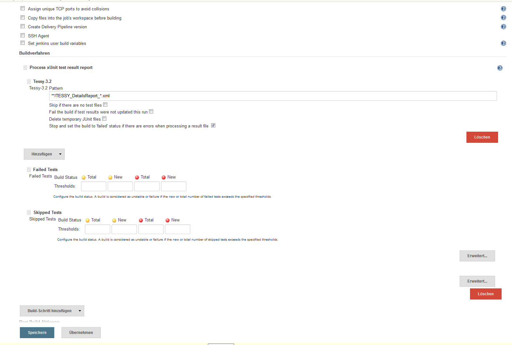

Jenkins Plugin that transforms Tessy details reports into xUnit format so they can be integrated with Jenkins' JUnit features.

# How it works

It has been developed as a [xUnit Plugin](https://wiki.jenkins-ci.org/display/JENKINS/xUnit+Plugin) extension.

To use it

1. select the build step "Process xUnit test result report" or "Publish xUnit test result report" post-build action.
2. In either case click on "Add" button
3. select "Tessy-3.2" from drop down list.
4. In the "Tessy-3.2 Pattern"  text box introduce the location of the Tessy details report files as generated by Tessy, e.g. `**/TESSY_DetailsReport_*.xml`.

## Mapping between Worlds

Test cases in Tessy can be organized in a tree of test objects and are subdivided in test steps.
JUnit reports (xUnit) however can only be organized in two levels (test suites and test cases contained within).
This plug-in maps Tessy test steps to jUnit test cases and maps further hierarchy information onto the test suite name.

More specifically it does:

* The xUnit test suite name matches `@/report/summary/info/@project_name + "." +  /report/summary/info/@module_name`.
* Test cases are named after `testcase/@name + "_" + teststep/@name` + "_" + teststep/@id`.
* The class name is the combination of the test suite name and `/report/summary/info/@testobject_name`.
